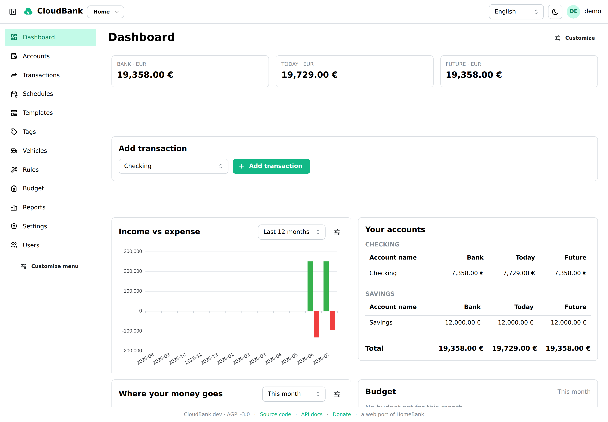
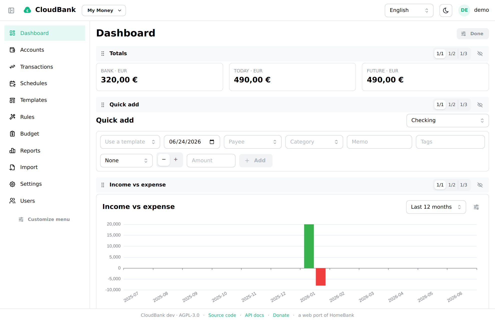
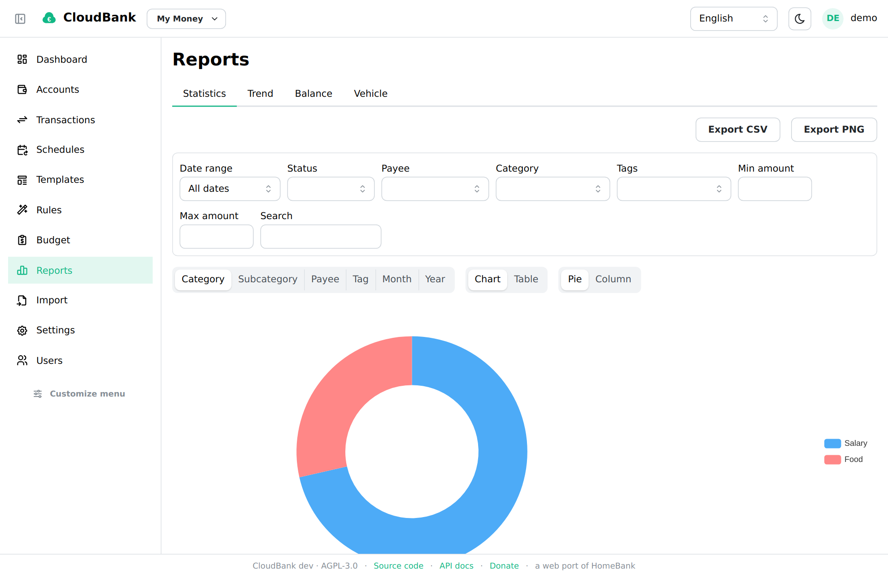
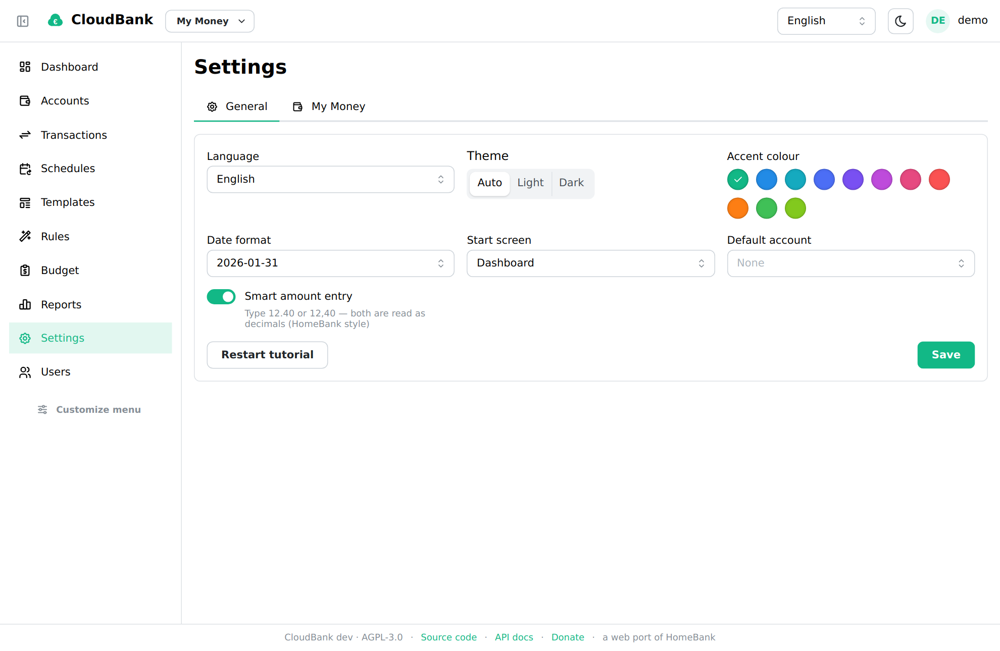
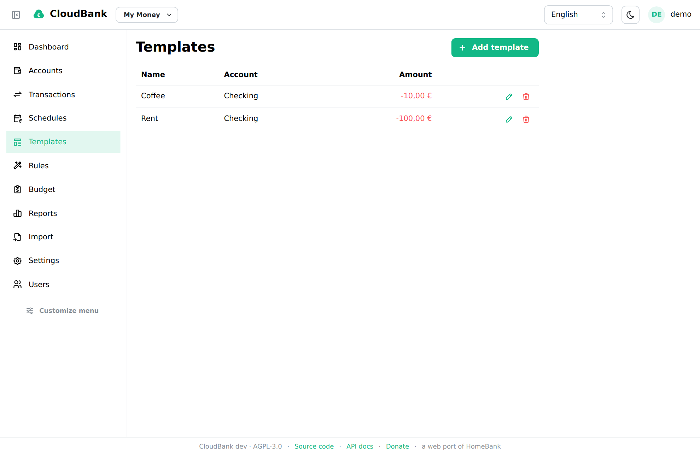
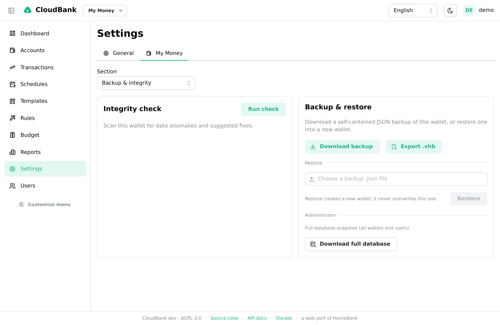

<p align="center">
  
</p>

<h1 align="center">CloudBank</h1>

<p align="center">
  <strong>Your money, self-hosted.</strong><br />
  A free, web-based personal finance manager — a from-scratch web port of <a href="https://www.gethomebank.org/">HomeBank</a>.
</p>

<p align="center">
  <a href="https://github.com/easly1989/cloudbank/actions/workflows/ci.yml"></a>
  <a href="https://github.com/easly1989/cloudbank/issues"></a>
  <a href="https://github.com/easly1989/cloudbank/pkgs/container/cloudbank"></a>
  <a href="LICENSE"></a>
  <a href="https://paypal.me/carloruggiero"></a>
  <a href="https://liberapay.com/amon2126/donate"></a>
  <a href="https://github.com/sponsors/easly1989"></a>
  <a href="https://buy.stripe.com/8x26oAeqA7h6dPk80hfbq00"></a>
</p>

---

**CloudBank** is a free, self-hosted, web-based personal finance manager — a from-scratch web port of the excellent [HomeBank](https://www.gethomebank.org/) desktop application. It aims for feature parity with HomeBank while being built for the browser and the cloud: a single Docker container you run yourself, with your data living in a SQLite database on a volume you control.

> Status: **production-ready.** Shipped 1.0 and iterating on personalization and
> HomeBank-parity polish — see the [CHANGELOG](CHANGELOG.md).

## Why

HomeBank is a fantastic GTK desktop app, but it is desktop-only. CloudBank brings the same workflow — accounts, a powerful transaction register, scheduled transactions, budgets, rich reports, and multi-format import (including native HomeBank `.xhb` import **and export**) — to a web UI you can reach from any device, while keeping the data on your own server.

CloudBank is an **independent, clean-room reimplementation**. It does not copy or link any HomeBank source code; the original is referenced only for its documented behavior and file formats, and CloudBank tracks parity with current and future HomeBank releases. CloudBank is released under the **AGPL-3.0** (HomeBank itself is GPL-2+).

## Screenshots

|                    Dashboard                     |                  Customizable layout                  |
| :----------------------------------------------: | :---------------------------------------------------: |
|              |  |

|                   Reports                    |                Preferences & themes                |
| :------------------------------------------: | :------------------------------------------------: |
|              |                  |

|                 Templates                  |          HomeBank `.xhb` export & backup           |
| :----------------------------------------: | :------------------------------------------------: |
|        |                      |

## Features

- **Accounts** of every HomeBank type (bank, cash, checking, savings, credit card, liability, asset, investment) with per-account currency, a **default payment mode**, and the full set of flags, showing both today's balance and a projected future balance.
- **Transactions** with 12 payment types, the cleared/reconciled status lifecycle, category splits, free tags, internal transfers (including cross-currency), bulk edit and duplicate detection.
- **Register** view with running balance, rich filtering (including a show/hide **future transactions** toggle), per-user column customization, a **selection total** (net + income/expense split of the currently selected rows), a reconciliation workflow, and double-click-to-edit.
- **Scheduled transactions** with automatic posting (optionally **pre-registering up to 3 months ahead**, HomeBank style), a **per-week/month/year income & expense summary**, the recurring **amount** shown in the schedules grid, **templates** (a dedicated management area, and offered when entering a transaction), and **assignment rules** for auto-categorization.
- **Budgets** and a full suite of **reports** (Statistics, Trend Time, Balance, Budget, Vehicle cost) with interactive charts and CSV/PNG export.
- **Import**: HomeBank `.xhb`, QIF, OFX/QFX, CSV — with an import assistant. **Export**: HomeBank `.xhb`, QIF, CSV.
- **Multi-currency** with manual and online (ECB / frankfurter.app) exchange rates.
- Multi-user (admin-managed), responsive UI, English and Italian.

### Make it yours

- **Fully customizable, free-form dashboard** — place and resize widgets anywhere on a grid, and add **multiple instances of any widget** from a palette, each with its own settings. A varied widget library covers the standard cases (base-currency totals, quick-add, income/expense, accounts, spending donut, budget gauge, upcoming) plus building blocks for a custom layout (single **account balance**, **recent transactions**, a **key-figure** big-number, and free-text **notes**). Pick an account and **Add** opens the full entry modal; the Upcoming panel splits into **Recurring / Future / Reminders** with post / skip / edit. Existing dashboards migrate automatically, and the grid stacks to one column on phones.
- **Themes** — light / dark / auto plus an **accent-colour picker**; your choice persists per user across devices.
- **Collapsible sidebar** and a **pinnable, reorderable navigation** ("More" group for the rest).
- **Smart amount entry** (HomeBank style) — type `12.40` or `12,40` and both are read as decimals (toggleable per user).
- **Dates** rendered everywhere in your configured format.
- A **first-login tutorial** that points out the essentials — dismissable, shown once, and restartable from Settings.

## Quick start

You need [Docker](https://docs.docker.com/get-docker/) with the Compose plugin.
Create a `docker-compose.yml` (or copy [the one in this repo](docker-compose.yml)):

```yaml
services:
  cloudbank:
    image: ghcr.io/easly1989/cloudbank:main # latest stable release (see tags below)
    container_name: cloudbank
    restart: unless-stopped
    ports:
      - "8080:8080"
    environment:
      # Set to "false" only for a plain-HTTP LAN install without TLS in front.
      CB_SECURE_COOKIES: "false"
    volumes:
      - cloudbank-data:/data

volumes:
  cloudbank-data:
```

Then start it and open the app:

```bash
docker compose up -d
# open http://localhost:8080 and complete the first-run admin setup
```

That is the whole install — one container, no external database. Your data lives
in the `cloudbank-data` volume (a SQLite database under `/data`). Back it up by
copying that volume, or use the in-app **wallet backup** (Settings → Wallet tab)
and the admin **full-database backup**.

Running behind HTTPS (recommended for anything beyond a trusted LAN)? See
[docs/reverse-proxy.md](docs/reverse-proxy.md). Coming from the HomeBank desktop
app? See [docs/migrate-from-homebank.md](docs/migrate-from-homebank.md).

## Documentation

- **API**: interactive Swagger UI is served by the app at **`/api/docs`** (the
  OpenAPI spec is at `/api/openapi.yaml`).
- **Reverse proxy / HTTPS**: [docs/reverse-proxy.md](docs/reverse-proxy.md).
- **Migrating from HomeBank**: [docs/migrate-from-homebank.md](docs/migrate-from-homebank.md).
- **Contributing / running from source**: [CONTRIBUTING.md](CONTRIBUTING.md).
- **Landing site** (source): [`site/`](site/) — built with Astro and published to GitHub Pages.

### Configuration

| Env var             | Default             | Description                                                 |
| ------------------- | ------------------- | ----------------------------------------------------------- |
| `CB_ADDR`           | `:8080`             | Address the HTTP server listens on.                         |
| `CB_DATA_DIR`       | `/data`             | Directory holding the SQLite database and backups.          |
| `CB_LOG_LEVEL`      | `info`              | `debug`, `info`, `warn`, or `error`.                        |
| `CB_SECURE_COOKIES` | `true`              | Set `false` for plain-HTTP LAN installs (no TLS).           |
| `CB_RATE_URL`       | _(frankfurter.app)_ | Override the online exchange-rate API root (e.g. a mirror). |

## Container images and tag convention

Images are published to **GHCR**: `ghcr.io/easly1989/cloudbank`.

> ⚠️ **Read this — the tag scheme is intentional and unconventional:**
>
> | Tag       | Meaning                                                                |
> | --------- | ---------------------------------------------------------------------- |
> | `:main`   | **Latest stable release** — use this for a stable self-hosted install. |
> | `:latest` | **Nightly build** from the `main` branch — bleeding edge, may break.    |
> | `:vX.Y.Z` | A specific released version (e.g. `:v1.0.0`). Also `:vX.Y`.             |
>
> In other words, `:latest` is the development nightly, and `:main` is the stable release. This is the opposite of the usual Docker convention, so pin deliberately.

**Availability:** `:latest` is published on every push to `main` (nightly
workflow). **`:main`** and the version tags are published by the **Release**
workflow — either by publishing a GitHub Release, or by running that workflow
manually from the **Actions** tab (it has a `workflow_dispatch` trigger, with an
optional version input). If a pull fails with `unauthorized`, the GHCR package is
private: make it public (package → Settings → Change visibility) or
`docker login ghcr.io` with a token that has `read:packages`.

## License

CloudBank is licensed under the **GNU Affero General Public License v3.0** — see [LICENSE](LICENSE). If you run a modified version as a network service, the AGPL requires you to offer your modified source to its users.

## Support the project

CloudBank is an open-source labour of love. If it's useful to you, consider a
donation — it genuinely helps and is much appreciated. ♥ Pick whichever suits
you on the [**donation page**](https://easly1989.github.io/cloudbank/donate/):
[PayPal](https://paypal.me/carloruggiero),
[Liberapay](https://liberapay.com/amon2126/donate) or
[GitHub Sponsors](https://github.com/sponsors/easly1989).

## Credits

Inspired by and aiming for parity with [HomeBank](https://www.gethomebank.org/) by Maxime Doyen. CloudBank is built and maintained by Carlo Ruggiero ([@easly1989](https://github.com/easly1989)) and is not affiliated with or endorsed by the HomeBank project.
